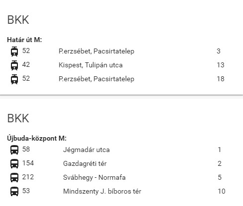

[](https://github.com/hacs/integration)

<p><a href="https://www.buymeacoffee.com/6rF5cQl" rel="nofollow" target="_blank"></a></p>

# BKK Stop Information custom component for Home Assistant
## Providing also a custom state card for legacyUI. 

This custom component and custom card shows Budapest Public Transportation (BKK)
line information departing in the near future from a configurable stop.<p>

#### Installation
The easiest way to install it is through [HACS (Home Assistant Community Store)](https://github.com/hacs/integration),
search for <i>BKK Stop Information</i> in the Integrations.<br />

If you are not using HACS, download the files from custom_components/bkk_stop into your
$homeassistant_config_dir/custom_components/bkk_stop.<br />

Once downloaded and configured as per below information you'll need to restart HomeAssistant to have the custom component
and the sensors of bkk_stop platform taken into consideration.

#### Configuration:
Define sensors with the following configuration parameters:<br />

---
| Name | Optional | `Default` | Description |
| :---- | :---- | :------- | :----------- |
| name | **N** | - | sensor of bkk_stop type to display |
| stopId | **N** | - | StopId as per [futar.bkk.hu](http://futar.bkk.hu) |
| minsAfter | **Y** | `20` | Number of minutes ahead to show vehicles departing from station |
| wheelchair | **Y** | `false` | Display vehicle's wheelchair accessibility |
| bikes | **Y** | `false` | Display whether bikes are allowed on vehicle |
| ignoreNow | **Y** | `true` | Ignore vehicles already in the station |
---

#### Example
```
platform: bkk_stop
name: 'bkk7u'
stopId: 'BKK_F00940'
minsAfter: 25
wheelchair: true
```

#### Lovelace UI
There is a Lovelace custom card related to this component at [https://github.com/amaximus/bkk-stop-card](https://github.com/amaximus/bkk-stop-card).

#### Legacy UI
Custom state card is provided for presenting data on legacy UI. Pls see the legacyUI directory structure for example.

Lovelace UI:<br />

