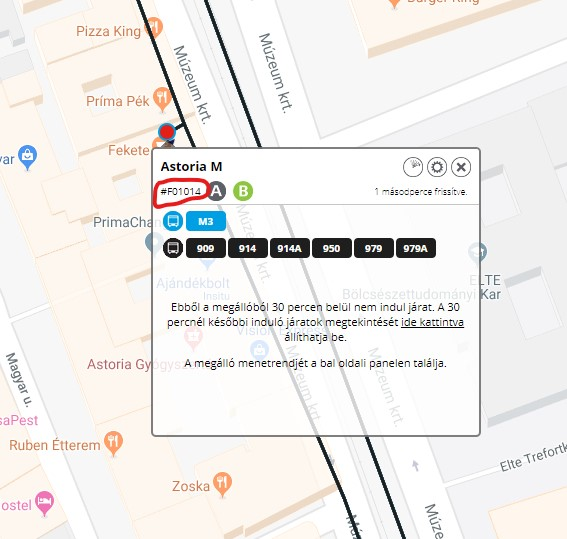

# Custom components for Home Assistant
## BKK stop custom component and state card

This custom component and custom state card shows Budapest Public Transportation (BKK)
line information departing in the near future from a configurable stop.

#### Configuration variables:
**name** (Optional): Name of component<br />
**stopId** (Required): StopId as per [futar.bkk.hu](http://futar.bkk.hu)<br />
**minsAfter** (Optional): Number of minutes ahead to show vehicles departing from station (default: 20)<br />
**wheelchair** (Optional): Display vehicle's wheelchair accessibility (default: false)<br />
**bikes** (Optional): Display whether bikes are allowed on vehicle (default: false)<br />
**ignoreNow** (Optional): Ignore vehicles already in the station (default: true) <br />

#### Example
```
  - platform: bkk_stop
    name: 'bkk7u'
    stopId: 'BKK_F00940'
    minsAfter: 25
    wheelchair: true
    bike: true
```
#### How to get StopId:
Visit [futar.bkk.hu](http://futar.bkk.hu) and select your stop, then copy the id like this:


#### Example card:

